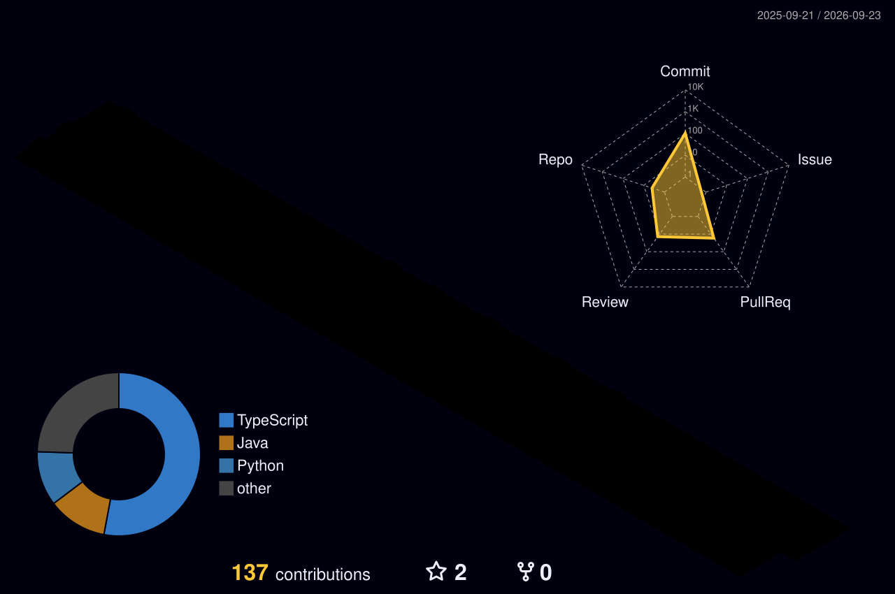

# Berkuk Karacay

### QA Automation Engineer | SDET

QA Automation Engineer with 2+ years of experience designing and implementing scalable UI & API test automation frameworks.  
Passionate about ensuring software quality through **reliable, maintainable, and CI/CD-integrated automation solutions**.

---

## 📊 GitHub Contributions

---

### 🧪 Core Skills & Experience

- 🚀 **Primary Stack:** Python, Pytest, Selenium
  - Building **robust end-to-end automation frameworks**

- 🧩 **BDD Automation:** Java, Cucumber, Gherkin
  - Writing **readable, business-driven test scenarios**

- 🔌 **API Testing:** Postman
  - Validating backend services and integrations

- 🗄️ **Data Validation:** SQL
  - Ensuring data integrity across systems

- 📱 **Mobile Testing:** Android Studio

- ⚡ **Modern Tools:** Playwright (basic experience)

- 🔄 **CI/CD Integration:**
  - Automation integrated into **real-world pipelines**

---

### 🎯 Focus

Delivering high-quality software through:

- Scalable test architecture
- Reliable and maintainable automation
- End-to-end quality assurance across UI, API, and mobile platforms

---

## 🧪 Automation Frameworks

### 🔹 Java + Selenium + Cucumber (BDD)

- Hybrid UI + API automation framework
- Built with **Selenium, Cucumber, JUnit, Maven**
- Designed BDD test scenarios aligned with business workflows
- Integrated with **GitHub Actions CI/CD** for automated execution

---

### 🔹 Python + Playwright + Pytest

- Modern UI automation framework
- Built with **Playwright, Pytest, Allure Reporting**
- Designed for **scalable and maintainable test structure**
- Integrated with **GitHub Actions** for continuous testing

---

## 🛠️ Languages & Tools

---

## 🎯 Current Focus

- Python-based automation (**Selenium & Playwright**)
- API testing & backend validation
- SQL & data-level verification
- CI/CD integration (**GitHub Actions**)

---

## 🧠 Core Expertise

- UI Automation (**Selenium, Playwright**)
- API Testing (**Postman, REST Assured, Requests**)
- BDD (**Cucumber**)
- Test Architecture (**Page Object Model**)
- CI/CD Pipelines (**GitHub Actions, Jenkins**)
- Performance Testing (**JMeter**)
- Dockerized test environments

---

## 🌐 Connect With Me

---

## 📌 About Me

- 2+ years in QA Automation
- Hands-on experience building **E2E automation frameworks**
- Strong focus on **test stability and CI/CD integration**
- Experience debugging failures and improving automation reliability

---

⭐ Focused on building automation that supports real production systems
